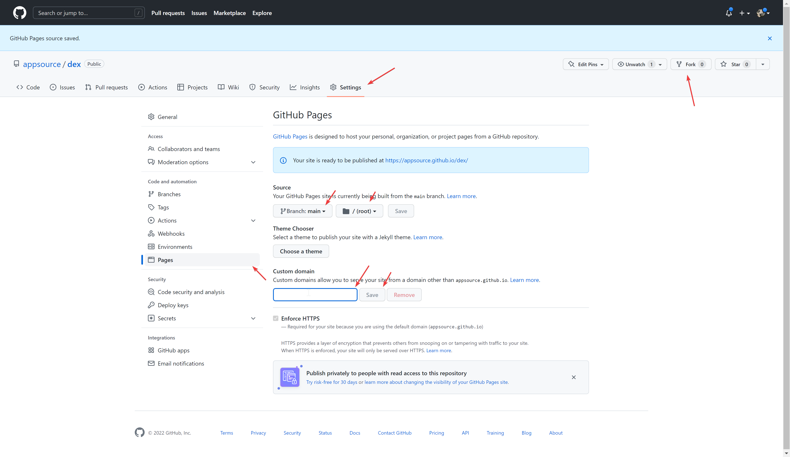

# Erc20, BEP20 exchange creation tool
DEX White-label at your own domain without coding skills. 2 CLICK INSTALLATION, JUST FORK AND ADD DOMAIN

Video: https://www.youtube.com/watch?v=x6LJTJCVWiI 

# Price . Start for free
Once you start earning from these tools, we will charge only 1/5 of your profit (not volume). Alternatively, you can avoid this fee by purchasing the premium version (https://onout.org/dex/) of the tool. Our RevShare model offers several benefits, including the ability to start using the tools for free, only paying for them when they generate profit. This means you can test out the tools without any upfront costs.

# howto
1. fork this repo
2. go to settings (check the address github/YOURNAME/dex, not https://github.com/appsource/dex/!) and enable Github pages

3. add your "custom domain" (don't forget to change DNS of your domain. <a href="https://www.youtube.com/watch?v=EX4w9hsduNA" target="_blank">video tutorial</a>)

# change list of available networks

1. click edit in "index.html" file and add this code at the beginning 
```
<script type="text/javascript">
  window.SO_Definance = {}
  window.SO_Definance.chainIds = ["56","137","250"];
  window.ONOUT_refport = 'https://refport.onout.org/';
  window.ONOUT_chatidForRefport = 1232131232;
</script>
```
1. Where ["56","137","250"] the networks you want to be shown. 
List of available networks: https://github.com/noxonsu/unifactory/blob/main/src/networks.json . 
To add a private chain please contact https://t.me/onoutsupportbot or email support@onout.org (read more https://support.onout.org/hc/1331700057/32/addnewnetwork?category_id=8 )

2. ONOUT_refport - url to send logs about connected address and his referrer (for social referral network activities). Remove this line or comment to disable reports
3. window.ONOUT_chatidForRefport - id of your chat where you have added @testonoutbot who will send you reports. Add @getmyid_bot to your group to get the ID. 


# to update
run github codespace with 16gb RAM then:
```
git clone https://github.com/noxonsu/unifactory
cd unifactory
nvm use
nvm install
npm i
npm run build_clean
```
move files from build folder to this repository root folder (don't forget to "rm -rf unifactory")
```
rsync -av --remove-source-files ./build/ ../
cd ..
rm -rf unifactory
```
